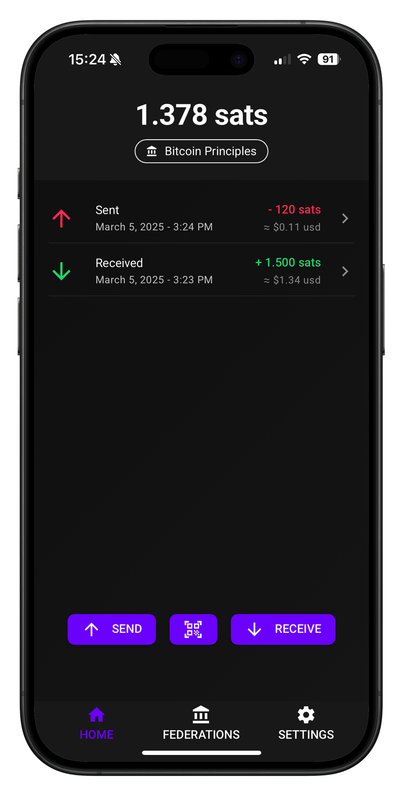
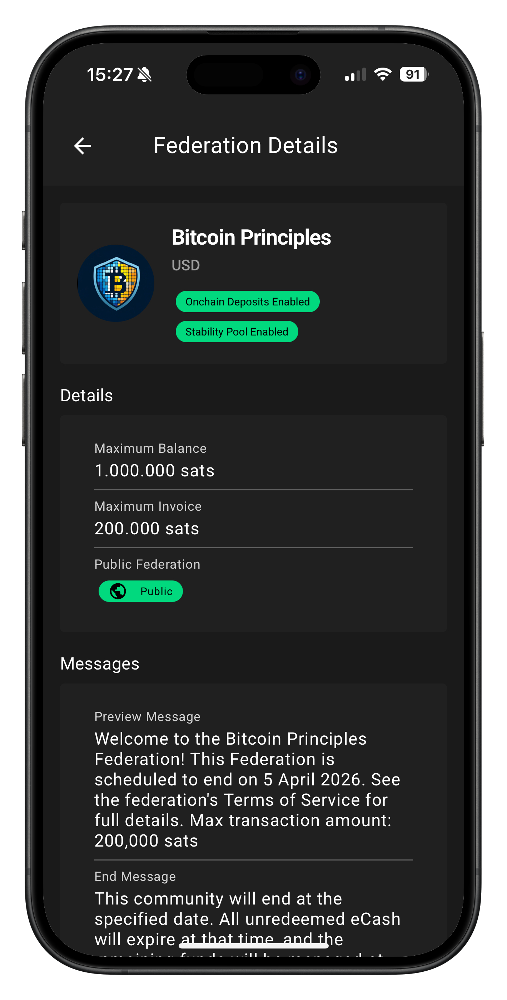
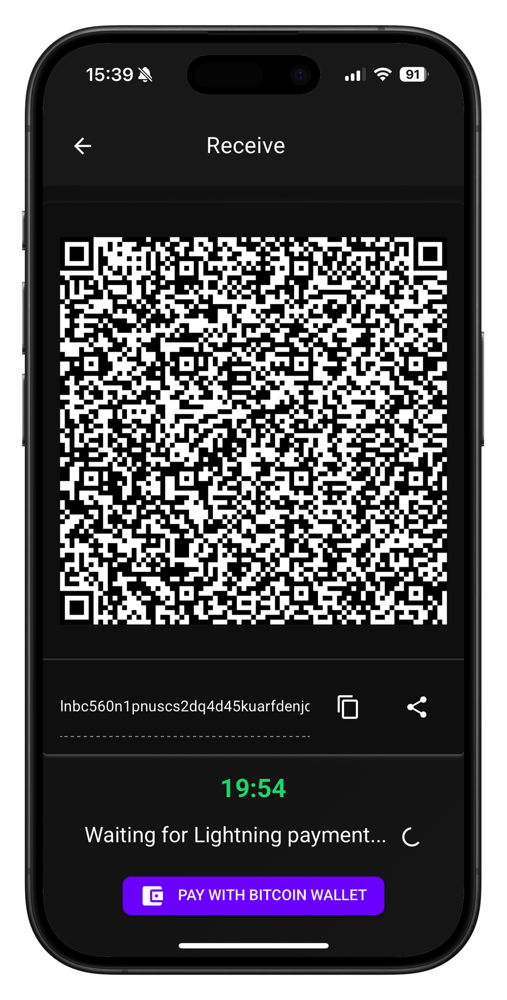

[](https://github.com/ngutech21/vipr-wallet/actions/workflows/ci.yaml)
[](https://github.com/ngutech21/vipr-wallet/actions/workflows/test.yaml)

---

# Vipr-Wallet

Vipr-Wallet is a modern Progressive Web App (PWA) that serves as an ecash wallet for Fedimint. It runs seamlessly on both mobile and desktop devices, enabling private and instant lightning transactions wherever you are.

# ⚠️ Disclaimer

This software is experimental and comes with risks:

- Current version is in **beta stage** with incomplete features and potential bugs
- **NO BACKUP FUNCTIONALITY** implemented yet - funds could be lost permanently
- **DO NOT USE** with significant amounts of ecash or in production environments

By using this wallet, you acknowledge and accept these risks.

## 📱 App Screenshots

|               Home Dashboard                |                      Federation                      |               Receive Payment                |
| :-----------------------------------------: | :--------------------------------------------------: | :------------------------------------------: |
|  |  |  |

## ✨ Features

### General

- [x] lightning send
- [x] receive tokens by paying a lightning invoice
- [x] pay lightning invoice using nostr wallet connect
- [ ] lnurl-p support
- [x] lightning address support
- [ ] pay to Nostr contacts
- [ ] export ecash
- [ ] import ecash

### Federations

- [x] Discover federations using nostr
- [ ] show guardian health

## 🐳 Deployment

### Docker Image

The latest version of Vipr Wallet is available on Docker Hub:

```bash
docker pull ngutech21/vipr-wallet:latest
```

### Quick Start

Run the latest container from dockerhub locally:

```bash
docker run -d \
  -p 8080:80 \
  --name vipr-wallet \
  ngutech21/vipr-wallet:latest
```

Run the container locally using docker-compose:

```bash
docker compose up -d
```

The wallet will be available at `http://localhost:8080`

## 🚀 Getting Started

### Prerequisites

Make sure you have the following installed:

- Node.js 20+
- pnpm 10+
- Quasar CLI

### Installation

1. **Install Quasar CLI**

```bash
npm i -g @quasar/cli
```

2. **Install pnpm**

```bash
npm install -g pnpm@latest-10
```

3. **Clone the repository**

```bash
git clone https://github.com/ngutech21/vipr-wallet.git
cd vipr-wallet
```

4. **Install the dependencies**

```bash
pnpm install
```

5.  **Start the app in development mode (hot-code reloading, error reporting, etc.)**

```bash
pnpm dev
```

### 🛠️ Development

| Command       | Description                              |
| ------------- | ---------------------------------------- |
| `pnpm dev`    | Start development server with hot reload |
| `pnpm build`  | Build for production                     |
| `pnpm lint`   | Run ESLint on source files               |
| `pnpm format` | Format code with Prettier                |
| `pnpm test`   | Run unit tests                           |
