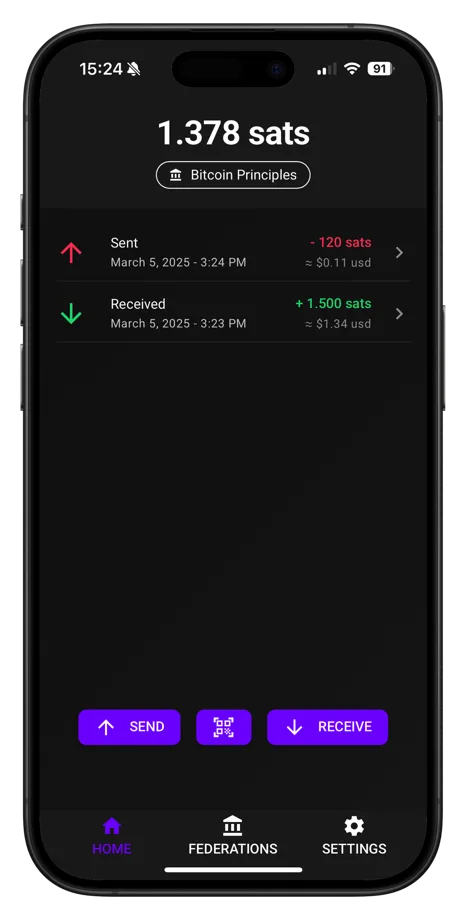
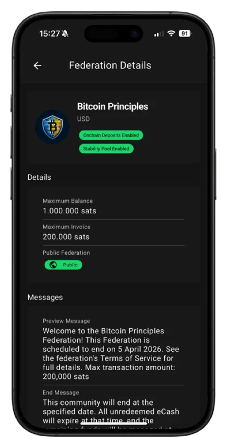
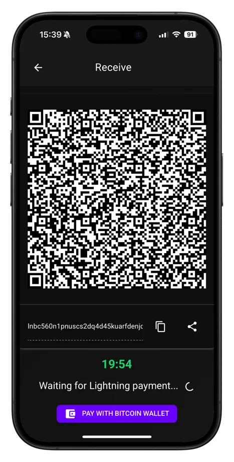

[](https://github.com/ngutech21/vipr-wallet/actions/workflows/actionlint.yml)
[](https://github.com/ngutech21/vipr-wallet/actions/workflows/spelling.yml)
[](https://github.com/ngutech21/vipr-wallet/actions/workflows/ci.yaml)
[](https://github.com/ngutech21/vipr-wallet/actions/workflows/e2e-test.yaml)
[](https://github.com/ngutech21/vipr-wallet/actions/workflows/lighthouse.yaml)
[](https://app.codecov.io/gh/ngutech21/vipr-wallet/)

---

# Vipr Wallet

Vipr Wallet is a modern Progressive Web App (PWA) that serves as an ecash wallet for Fedimint. It runs seamlessly on both mobile and desktop devices, enabling private and instant lightning transactions wherever you are.

# ⚠️ Disclaimer

This software is experimental and comes with risks:

- Current version is in **beta stage** with incomplete features and potential bugs
- **DO NOT USE** with significant amounts of ecash or in production environments

By using this wallet, you acknowledge and accept these risks.

A demo version of the wallet is available at [beta.vipr.cash](https://beta.vipr.cash)

Learn more about the project at [vipr.cash](https://vipr.cash)

## 📱 App Screenshots

<div align="center">
  
  
  
</div>

## ✨ Features

### General

- [x] lightning send
- [x] receive tokens by paying a lightning invoice
- [x] pay lightning invoice using nostr wallet connect
- [x] lnurl-p support
- [x] lightning address support
- [x] pay to Nostr contacts
- [x] export ecash
- [x] import ecash
- [x] backup wallet
- [x] restore wallet
- [x] pay onchain
- [x] receive onchain

### Federations

- [x] join multiple federations
- [x] Discover federations using nostr
- [ ] show guardian health
- [x] show nostr votes for federation

## 🐳 Deployment

### Docker Image

If you want to host the wallet yourself, you can use the Docker image on Docker Hub.

```bash
docker pull ngutech21/vipr-wallet:latest
```

### Quick Start

Run the latest container from dockerhub locally:

```bash
docker run -d \
  -p 8080:80 \
  --name vipr-wallet \
  ngutech21/vipr-wallet:latest
```

Run the container locally using docker-compose:

```bash
docker compose up -d
```

The wallet will be available at `http://localhost:8080`

## 🚀 Getting Started

### Development Environment

- This project uses [Vue 3](https://v3.vuejs.org/) with [TypeScript](https://www.typescriptlang.org/)
- [Quasar Framework](https://quasar.dev/) provides the UI components
- [Pinia](https://pinia.vuejs.org/) is used for state management
- [Fedimint-SDK](https://github.com/fedimint/fedimint-sdk) is used for interacting with the fedimint

### Prerequisites

Make sure you have the following installed:

- Node.js 24+
- pnpm 10+
- Nix with flakes enabled for running end-to-end tests locally

### Installation

1. **Clone the repository**

```bash
git clone https://github.com/ngutech21/vipr-wallet.git
cd vipr-wallet
```

2. **Install pnpm**

```bash
npm install -g pnpm@latest-10
```

3. **Install the dependencies**

```bash
pnpm install
```

4. **Run the standard local quality checks**

```bash
pnpm final-check
```

5. **Start the app in development mode (hot-code reloading, error reporting, etc.)**

```bash
pnpm dev
```

6. **Run end-to-end tests locally**

```bash
nix develop --accept-flake-config --command pnpm test:e2e
```

### Getting Started Tips

- Use `pnpm final-check` before opening a pull request. It runs formatting checks, linting, type checks, unit tests, and a production dependency audit.
- Use `pnpm build` to verify the production PWA build locally.
- Use `pnpm build:docker` if you want to validate the container image build path used by the project.
- Lighthouse CI and the main CI workflows are configured in GitHub Actions, so local checks and CI should stay close to each other.

### 🛠️ Development

| Command                | Description                                                     |
| ---------------------- | --------------------------------------------------------------- |
| `pnpm dev`             | Start the development server with hot reload                    |
| `pnpm dev:e2e`         | Start the app on a fixed port for browser-based end-to-end work |
| `pnpm build`           | Build the production PWA                                        |
| `pnpm build:docker`    | Build the Docker image locally                                  |
| `pnpm lint`            | Run ESLint on source files                                      |
| `pnpm lint:fix`        | Run ESLint and automatically fix safe issues                    |
| `pnpm format`          | Format code with Prettier                                       |
| `pnpm format:check`    | Verify formatting without modifying files                       |
| `pnpm typecheck`       | Run Vue TypeScript checks                                       |
| `pnpm typecheck:pwa`   | Run TypeScript checks for the PWA service worker code           |
| `pnpm test`            | Run unit tests once                                             |
| `pnpm test:unit:ci`    | Run unit tests in CI mode                                       |
| `pnpm test:unit:ui`    | Open the Vitest UI                                              |
| `pnpm coverage`        | Generate the unit test coverage report                          |
| `pnpm test:e2e`        | Run end-to-end tests from a Nix dev shell                       |
| `pnpm test:e2e:headed` | Run Playwright tests with a visible browser                     |
| `pnpm final-check`     | Run the main local verification suite before pushing changes    |
